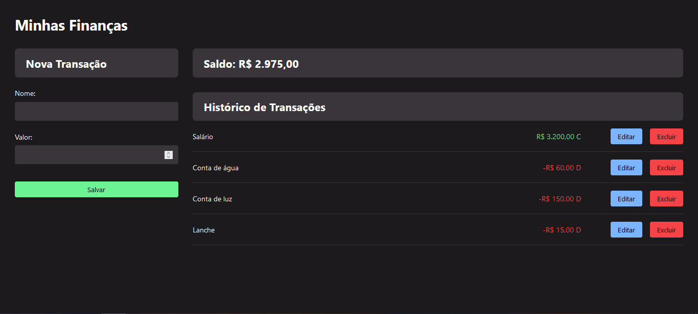

App de controle financeiro


Projeto construído durante o curso Full Stack Javascript da OneBitCode

Para iniciar o projeto, acesse o banco de dados através do terminal integrado, usando o comando:
```
npm run serve 
```

Depois, acesse o arquivo index.html e o abra com a extensão Live Server (Open with Live Server)

Modo de uso: Você pode adicionar qual o título da saída ou entrada de renda, definindo se é saída usando valores negativos, ou entrada através de valores positivos. Também é possível excluir transações indesejadas ou editá-las, e seu saldo será atualizado automaticamente baseado nessas alterações.

Para encerrar o banco de dados, use os seguintes comandos:
```
Shift+C
S
```

Lembrando que, a partir deste momento, suas alterações no banco de dados não serão salvas.

[Clique aqui para acessar](https://igormolinals.github.io/App-de-financas/)

## Tecnologias

-HTML
<br/>
-CSS
<br/>
-JavaScript
<br/>
-Git e Github
<br/>
-nodeJS

## Contato
igoramil452@gmail.com
https://www.linkedin.com/in/igor-molinals/